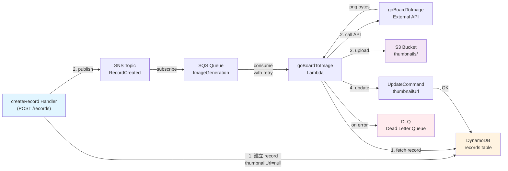
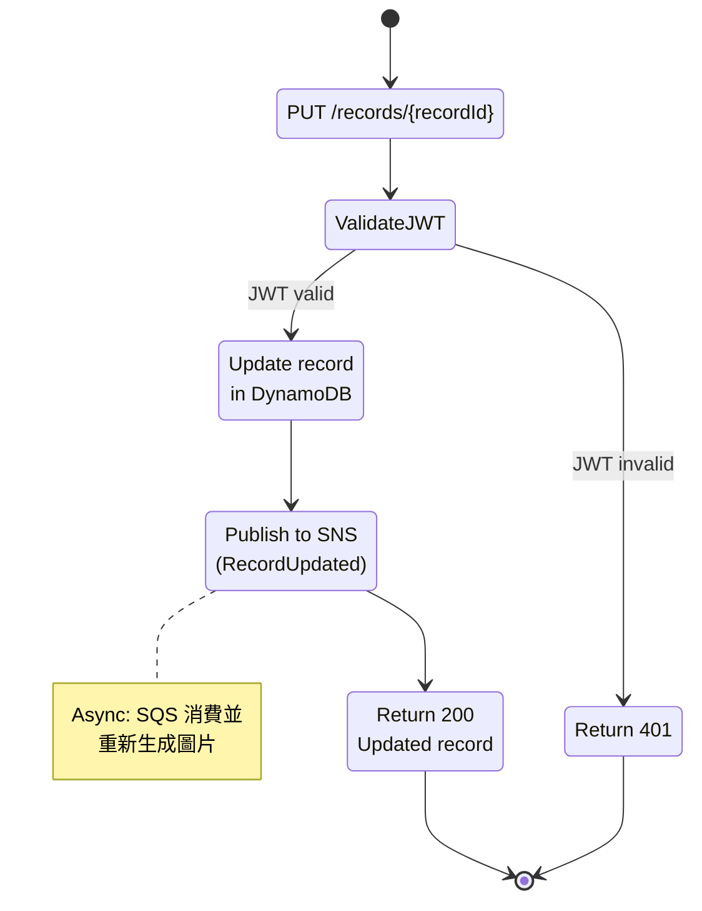

# 棋譜轉圖片功能 PRD

## 1. 目標與願景

### 目標
- 提供棋譜縮圖生成機制，支援異步處理
- 棋譜建立時自動觸發圖片生成流程
- 保證棋譜資料建立不受圖片生成失敗影響
- 支援棋譜更新時重新生成圖片
- 前端可獲取縮圖 URL 展示棋譜列表

### 願景
採用 **事件驅動 + 最終一致性** 架構：
- **SNS/SQS 非同步解耦** — 棋譜建立獨立於圖片生成
- **DLQ 失敗追蹤** — 圖片生成失敗有可追蹤的重試機制
- **增量更新** — 棋譜更新時自動重新生成圖片

---

## 2. 功能詳述

### 2.1 棋譜資料模型擴展

| 欄位 | 型別 | 說明 | 必填 |
|------|------|------|------|
| `thumbnailUrl` | S | 縮圖圖片在 S3 的 URL；未生成時為 `null` | N |

**變更**：在現有 `records` 表中新增 `thumbnailUrl` 欄位（nullable）

### 2.2 棋譜建立流程（異步圖片生成）

```
POST /records (createRecordHandler)
  ↓
1. 驗證 JWT 與請求資料
2. 建立 record（thumbnailUrl = null）存入 DynamoDB
3. Publish 訊息到 SNS，帶 (userId, recordId, gameTree)
4. 返回 201，record 基本資訊
  ↓
SNS → SQS （後台消費）
  ↓
goBoardToImage Lambda
  ↓
1. 從 DynamoDB 讀取 record
2. 調用外部 goBoardToImage API（轉 PNG）
3. 上傳圖片到 S3
4. 更新 DynamoDB record.thumbnailUrl
5. 刪除 SQS 訊息（成功）
  ↓
失敗 → SQS 自動重試 → 最終進 DLQ
```

### 2.3 棋譜更新流程（重新生成縮圖）

```
PUT /records/{recordId} (updateRecordHandler)
  ↓
1. 驗證 JWT 與資料
2. 更新 record（title、gameTree）
3. Publish 訊息到 SNS
4. 返回 200，更新後的 record
  ↓
[同棋譜建立流程]
```

### 2.4 棋譜列表查詢（包含縮圖 URL）

```
GET /records (listRecordsHandler)
  ↓
返回欄位增加 thumbnailUrl
  ↓
Response:
{
  "records": [
    {
      "recordId": "...",
      "title": "...",
      "thumbnailUrl": "https://s3.../path/to/image.png",
      "createdAt": "...",
      "updatedAt": "..."
    }
  ],
  "nextCursor": "..."
}
```

### 2.5 單一棋譜查詢（包含縮圖 URL）

```
GET /records/{recordId} (getRecordHandler)
  ↓
返回欄位增加 thumbnailUrl
```

---

## 3. 業務邏輯圖

### 3.1 棋譜建立與圖片生成流程



### 3.2 棋譜更新流程



---

## 4. 參考檔案路徑

### 現有相關檔案
| 檔案 | 說明 |
|------|------|
| `src/services/recordService.ts` | Record CRUD 邏輯 |
| `src/handlers/records/createRecord.ts` | 建立棋譜 handler |
| `src/handlers/records/updateRecord.ts` | 更新棋譜 handler |
| `src/handlers/records/listRecords.ts` | 列表查詢 handler |
| `src/handlers/records/getRecord.ts` | 單一棋譜查詢 handler |
| `src/middleware/authMiddleware.ts` | JWT 驗證 |
| `template.yaml` | SAM 範本 |

### 新增檔案
| 檔案 | 說明 |
|------|------|
| `src/services/imageService.ts` | 圖片生成相關邏輯（SNS publish、S3 upload） |
| `src/handlers/imageGeneration/goBoardToImage.ts` | goBoardToImage Lambda handler |
| `src/handlers/imageGeneration/__tests__/goBoardToImage.test.ts` | 圖片生成單元測試 |

---

## 5. 範例程式碼

### 5.1 recordService 擴展 — 新增 thumbnailUrl 欄位

```typescript
// src/services/recordService.ts

export interface RecordItem {
  recordId: string;
  title: string;
  gameTree: Record<string, unknown>;
  thumbnailUrl: string | null;  // 新增
  createdAt: string;
  updatedAt: string;
}

export interface RecordListItem {
  recordId: string;
  title: string;
  thumbnailUrl: string | null;  // 新增
  createdAt: string;
  updatedAt: string;
}

// getRecord、createRecord、updateRecord 等返回值需更新
```

### 5.2 createRecord handler — 新增 SNS publish

```typescript
// src/handlers/records/createRecord.ts

import { publishRecordCreatedEvent } from '@/services/imageService';

export const createRecordHandler = async (
  event: APIGatewayProxyEvent,
  context: Context
): Promise<APIGatewayProxyResult> => {
  try {
    const user = await authenticate(event);
    // ... 驗證邏輯（同現有）

    const record = await createRecord(user.userId, title, gameTree);
    
    // 新增：發佈 SNS 事件，觸發圖片生成
    try {
      await publishRecordCreatedEvent(user.userId, record.recordId, gameTree);
    } catch (snsError) {
      console.error('Failed to publish image generation event:', snsError);
      // 不中斷棋譜建立流程——圖片生成失敗不影響棋譜建立
    }

    return createSuccessResponse(201, {
      recordId: record.recordId,
      title: record.title,
      thumbnailUrl: record.thumbnailUrl,  // 新增，值為 null
      createdAt: record.createdAt,
      updatedAt: record.updatedAt,
    });
  } catch (error) {
    console.error('Error in createRecordHandler:', error);
    return createErrorResponse(500, 'Internal server error');
  }
};
```

### 5.3 goBoardToImage Lambda handler

```typescript
// src/handlers/imageGeneration/goBoardToImage.ts

import { SQSEvent, SQSRecord } from 'aws-lambda';
import { generateAndUploadImage } from '@/services/imageService';

export const goBoardToImageHandler = async (event: SQSEvent): Promise<void> => {
  for (const record of event.Records) {
    try {
      const message = JSON.parse(record.body);
      const { userId, recordId, gameTree } = message;
      
      // 生成圖片、上傳 S3、更新 DynamoDB
      await generateAndUploadImage(userId, recordId, gameTree);
      
      // SQS 訊息自動刪除（Lambda 返回成功）
    } catch (error) {
      console.error('Failed to generate image for record:', error);
      // 拋出異常 → SQS 重試 → DLQ
      throw error;
    }
  }
};
```

### 5.4 imageService — SNS publish & S3 upload

```typescript
// src/services/imageService.ts

import { SNSClient, PublishCommand } from '@aws-sdk/client-sns';
import { S3Client, PutObjectCommand } from '@aws-sdk/client-s3';
import { updateRecord } from './recordService';

const sns = new SNSClient({});
const s3 = new S3Client({});

export const publishRecordCreatedEvent = async (
  userId: string,
  recordId: string,
  gameTree: Record<string, unknown>
): Promise<void> => {
  const topicArn = process.env.RECORD_CREATED_SNS_TOPIC_ARN;
  if (!topicArn) throw new Error('SNS topic ARN not configured');

  await sns.send(new PublishCommand({
    TopicArn: topicArn,
    Message: JSON.stringify({ userId, recordId, gameTree }),
  }));
};

export const generateAndUploadImage = async (
  userId: string,
  recordId: string,
  gameTree: Record<string, unknown>
): Promise<void> => {
  // 1. 呼叫外部 goBoardToImage API
  const response = await fetch(`${process.env.GO_BOARD_IMAGE_API_URL}`, {
    method: 'POST',
    body: JSON.stringify(gameTree),
  });
  
  if (!response.ok) throw new Error('goBoardToImage API failed');
  
  const imageBuffer = await response.arrayBuffer();

  // 2. 上傳到 S3
  const s3Key = `thumbnails/${userId}/${recordId}.png`;
  const bucketName = process.env.THUMBNAIL_BUCKET_NAME;
  
  if (!bucketName) throw new Error('S3 bucket name not configured');

  await s3.send(new PutObjectCommand({
    Bucket: bucketName,
    Key: s3Key,
    Body: imageBuffer,
    ContentType: 'image/png',
  }));

  // 3. 更新 DynamoDB record.thumbnailUrl
  const thumbnailUrl = `https://${bucketName}.s3.amazonaws.com/${s3Key}`;
  
  await updateRecord(userId, recordId, {}, gameTree);  // 新增 updateRecordThumbnail
  // 或直接在 imageService 中使用 UpdateCommand
};
```

---

## 6. 驗證項目

### 6.1 單元測試

| 測試項目 | 覆蓋範圍 | 驗證方式 |
|----------|----------|----------|
| `recordService.test.ts` | 新增 `thumbnailUrl` 欄位讀寫 | `npm test` 通過 |
| `createRecord.test.ts` | SNS publish 成功 & 失敗不影響建立 | mock SNS，驗證 record 建立成功 |
| `goBoardToImage.test.ts` | 圖片生成、S3 上傳、DB 更新 | mock S3、外部 API，驗證流程 |
| `imageService.test.ts` | SNS publish、S3 upload 邏輯 | 全 mock，驗證參數傳遞 |

### 6.2 執行驗證

- [ ] `npm test` — 所有單元測試通過
- [ ] `npm run build` — TypeScript 編譯成功
- [ ] SAM 本地測試：
  ```bash
  sam local start-api
  # 測試 POST /records → 建立 record，檢查 SNS 發佈
  # 檢查 SQS 隊列是否接收訊息
  ```

### 6.3 遊戲內驗證

- [ ] 前端建立棋譜 → 後端 201 返回（thumbnailUrl=null）
- [ ] SQS 消費圖片生成任務（模擬或真實 API）
- [ ] 圖片上傳到 S3
- [ ] DynamoDB record.thumbnailUrl 更新成功
- [ ] 前端查詢棋譜列表 → 返回 thumbnailUrl
- [ ] SNS/SQS 失敗場景 → 訊息進 DLQ

---

## 7. 開發任務清單 (TODO)

### 優先順序與依賴說明

**基礎優先** — 無 I/O 依賴的邏輯先做，再串接 AWS 服務：

1. ⏳ **Task 1 — 擴展 RecordService** — 新增 `thumbnailUrl` 欄位支援 (無依賴)
2. ⏳ **Task 2 — 擴展 Handlers** — createRecord/updateRecord/listRecords/getRecord 返回 thumbnailUrl (依賴 Task 1)
3. ⏳ **Task 3 — 實作 imageService** — SNS publish & S3 upload 邏輯 (無依賴)
4. ⏳ **Task 4 — 實作 goBoardToImage Lambda** — SQS 消費、圖片生成、DB 更新 (依賴 Task 1、Task 3)
5. ⏳ **Task 5 — SAM template 資源定義** — 在 template.yaml 定義 SNS Topic、SQS Queue、DLQ、S3 Bucket (依賴 Task 3、Task 4)
6. ⏳ **Task 6 — 部署與驗證 AWS 資源** — sam validate → sam deploy，驗證 SNS/SQS/DLQ/S3 建立成功 (依賴 Task 5)
7. ⏳ **Task 7 — 單元測試** — 各模組測試 (依賴 Task 1–6)

| # | 任務 | 預估 | 依賴 | 驗證 |
|---|------|------|------|------|
| 1 | 擴展 RecordService — 新增 `thumbnailUrl` 欄位讀寫邏輯 | 2h | - | `npm test — recordService.test.ts` |
| 2 | 更新 Record Handlers — createRecord/updateRecord/listRecords/getRecord 返回 `thumbnailUrl` | 3h | 1 | `npm test — handlers/**/*.test.ts` |
| 3 | 實作 imageService — SNS publish、S3 upload 邏輯 | 3h | - | `npm test — imageService.test.ts` |
| 4 | 實作 goBoardToImage Lambda handler | 4h | 1, 3 | `npm test — goBoardToImage.test.ts` |
| 5 | SAM template 資源定義 — 新增 SNS Topic、SQS Queue、DLQ、S3 Bucket、Lambda、環境變數 | 2h | 3, 4 | `sam validate` 無誤 |
| 6 | 部署與驗證 AWS 資源 — `sam deploy`，確認 SNS/SQS/DLQ/S3 建立成功，環境變數正確 | 1.5h | 5 | `sam deploy` 成功，AWS 控制台檢查資源 |
| 7 | 撰寫單元測試 — 全覆蓋（mock SNS、S3、外部 API） | 4h | 1–6 | `npm test` 100% 通過 |

**總預估** — 19.5 小時 ≈ 2.5 天（含部署驗證與測試）

### 可並行任務

- Task 1、2、3 可並行進行（無相互依賴）
- Task 4 與 Task 1、2、3 分別完成後可開始
- Task 5 與 Task 6 須按序（Task 6 依賴 Task 5 部署成功）
- Task 7（單元測試）在 Task 1–6 完成後進行

---

## 附錄：環境變數配置

```yaml
# template.yaml

Environment:
  Variables:
    RECORD_CREATED_SNS_TOPIC_ARN: !Ref RecordCreatedTopic
    IMAGE_GENERATION_SQS_QUEUE_URL: !Ref ImageGenerationQueue
    THUMBNAIL_BUCKET_NAME: !Ref ThumbnailBucket
    GO_BOARD_IMAGE_API_URL: <external-api-url>
    TABLE_NAME: !Ref DynamoDBTable
```

---

## 附錄：AWS 資源清單

### 新增 AWS 資源
| 資源 | 用途 |
|------|------|
| SNS Topic `RecordCreatedTopic` | 發佈棋譜建立/更新事件 |
| SQS Queue `ImageGenerationQueue` | 消費圖片生成任務 |
| SQS DLQ `ImageGenerationDLQ` | 失敗訊息追蹤 |
| S3 Bucket `ThumbnailBucket` | 儲存棋譜縮圖 |
| Lambda `goBoardToImageFunction` | 非同步圖片生成 |

---

**PRD 版本** — v1.0  
**最後更新** — 2026-04-06  
**負責人** — Allen Huang
